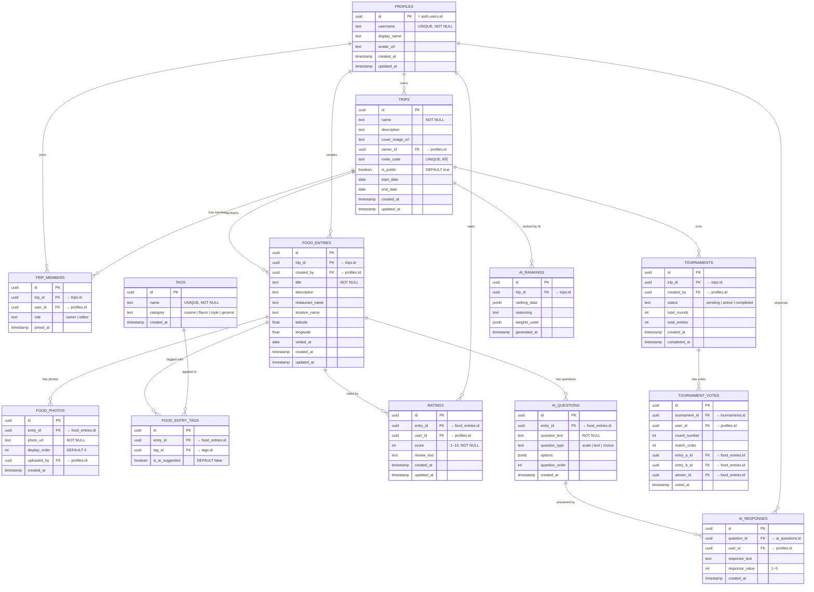

# TasteRank — Entity Relationship Diagram (ERD)

> **Version**: 2.0  
> **Date**: 2025-02-09  
> **Database**: PostgreSQL (Supabase)  

---

## 1. ER Diagram (Mermaid)



---

## 2. 테이블 DDL

### 2.1 profiles

```sql
CREATE TABLE public.profiles (
    id UUID PRIMARY KEY REFERENCES auth.users(id) ON DELETE CASCADE,
    username TEXT UNIQUE NOT NULL,
    display_name TEXT,
    avatar_url TEXT,
    created_at TIMESTAMPTZ DEFAULT NOW(),
    updated_at TIMESTAMPTZ DEFAULT NOW()
);

-- Google OAuth 가입 시 자동 생성
CREATE OR REPLACE FUNCTION public.handle_new_user()
RETURNS TRIGGER AS $$
BEGIN
    INSERT INTO public.profiles (id, username, display_name, avatar_url)
    VALUES (
        NEW.id,
        COALESCE(NEW.raw_user_meta_data->>'preferred_username', split_part(NEW.email, '@', 1)),
        COALESCE(NEW.raw_user_meta_data->>'full_name', NEW.raw_user_meta_data->>'name'),
        NEW.raw_user_meta_data->>'avatar_url'
    );
    RETURN NEW;
END;
$$ LANGUAGE plpgsql SECURITY DEFINER;

CREATE TRIGGER on_auth_user_created
    AFTER INSERT ON auth.users
    FOR EACH ROW EXECUTE FUNCTION public.handle_new_user();
```

### 2.2 trips

```sql
CREATE TABLE public.trips (
    id UUID PRIMARY KEY DEFAULT gen_random_uuid(),
    name TEXT NOT NULL,
    description TEXT,
    cover_image_url TEXT,
    owner_id UUID NOT NULL REFERENCES public.profiles(id) ON DELETE CASCADE,
    invite_code TEXT UNIQUE DEFAULT encode(gen_random_bytes(4), 'hex'),
    is_public BOOLEAN DEFAULT TRUE,  -- 기본 공개 (포트폴리오용)
    start_date DATE,
    end_date DATE,
    created_at TIMESTAMPTZ DEFAULT NOW(),
    updated_at TIMESTAMPTZ DEFAULT NOW()
);

CREATE INDEX idx_trips_owner ON public.trips(owner_id);
CREATE INDEX idx_trips_invite_code ON public.trips(invite_code);
CREATE INDEX idx_trips_public ON public.trips(is_public) WHERE is_public = TRUE;
```

### 2.3 trip_members

```sql
CREATE TABLE public.trip_members (
    id UUID PRIMARY KEY DEFAULT gen_random_uuid(),
    trip_id UUID NOT NULL REFERENCES public.trips(id) ON DELETE CASCADE,
    user_id UUID NOT NULL REFERENCES public.profiles(id) ON DELETE CASCADE,
    role TEXT NOT NULL DEFAULT 'editor' CHECK (role IN ('owner', 'editor')),
    joined_at TIMESTAMPTZ DEFAULT NOW(),
    UNIQUE(trip_id, user_id)
);

CREATE INDEX idx_trip_members_trip ON public.trip_members(trip_id);
CREATE INDEX idx_trip_members_user ON public.trip_members(user_id);
```

### 2.4 food_entries

```sql
CREATE TABLE public.food_entries (
    id UUID PRIMARY KEY DEFAULT gen_random_uuid(),
    trip_id UUID NOT NULL REFERENCES public.trips(id) ON DELETE CASCADE,
    created_by UUID NOT NULL REFERENCES public.profiles(id),
    title TEXT NOT NULL,
    description TEXT,
    restaurant_name TEXT,
    location_name TEXT,
    latitude DOUBLE PRECISION,
    longitude DOUBLE PRECISION,
    visited_at DATE DEFAULT CURRENT_DATE,
    created_at TIMESTAMPTZ DEFAULT NOW(),
    updated_at TIMESTAMPTZ DEFAULT NOW()
);

CREATE INDEX idx_food_entries_trip ON public.food_entries(trip_id);
```

### 2.5 food_photos

```sql
CREATE TABLE public.food_photos (
    id UUID PRIMARY KEY DEFAULT gen_random_uuid(),
    entry_id UUID NOT NULL REFERENCES public.food_entries(id) ON DELETE CASCADE,
    photo_url TEXT NOT NULL,
    display_order INT DEFAULT 0,
    uploaded_by UUID NOT NULL REFERENCES public.profiles(id),
    created_at TIMESTAMPTZ DEFAULT NOW()
);

CREATE INDEX idx_food_photos_entry ON public.food_photos(entry_id);
```

### 2.6 tags & food_entry_tags

```sql
CREATE TABLE public.tags (
    id UUID PRIMARY KEY DEFAULT gen_random_uuid(),
    name TEXT UNIQUE NOT NULL,
    category TEXT DEFAULT 'general' CHECK (category IN ('cuisine', 'flavor', 'style', 'general')),
    created_at TIMESTAMPTZ DEFAULT NOW()
);

CREATE TABLE public.food_entry_tags (
    id UUID PRIMARY KEY DEFAULT gen_random_uuid(),
    entry_id UUID NOT NULL REFERENCES public.food_entries(id) ON DELETE CASCADE,
    tag_id UUID NOT NULL REFERENCES public.tags(id) ON DELETE CASCADE,
    is_ai_suggested BOOLEAN DEFAULT FALSE,
    UNIQUE(entry_id, tag_id)
);

CREATE INDEX idx_food_entry_tags_entry ON public.food_entry_tags(entry_id);
```

### 2.7 ratings

```sql
CREATE TABLE public.ratings (
    id UUID PRIMARY KEY DEFAULT gen_random_uuid(),
    entry_id UUID NOT NULL REFERENCES public.food_entries(id) ON DELETE CASCADE,
    user_id UUID NOT NULL REFERENCES public.profiles(id),
    score INT NOT NULL CHECK (score >= 1 AND score <= 10),
    review_text TEXT,
    created_at TIMESTAMPTZ DEFAULT NOW(),
    updated_at TIMESTAMPTZ DEFAULT NOW(),
    UNIQUE(entry_id, user_id)
);

CREATE INDEX idx_ratings_entry ON public.ratings(entry_id);
```

### 2.8 ai_questions & ai_responses

```sql
CREATE TABLE public.ai_questions (
    id UUID PRIMARY KEY DEFAULT gen_random_uuid(),
    entry_id UUID NOT NULL REFERENCES public.food_entries(id) ON DELETE CASCADE,
    question_text TEXT NOT NULL,
    question_type TEXT DEFAULT 'text' CHECK (question_type IN ('scale', 'text', 'choice')),
    options JSONB,
    question_order INT DEFAULT 0,
    created_at TIMESTAMPTZ DEFAULT NOW()
);

CREATE TABLE public.ai_responses (
    id UUID PRIMARY KEY DEFAULT gen_random_uuid(),
    question_id UUID NOT NULL REFERENCES public.ai_questions(id) ON DELETE CASCADE,
    user_id UUID NOT NULL REFERENCES public.profiles(id),
    response_text TEXT,
    response_value INT CHECK (response_value >= 1 AND response_value <= 5),
    created_at TIMESTAMPTZ DEFAULT NOW(),
    UNIQUE(question_id, user_id)
);
```

### 2.9 tournaments & tournament_votes

```sql
CREATE TABLE public.tournaments (
    id UUID PRIMARY KEY DEFAULT gen_random_uuid(),
    trip_id UUID NOT NULL REFERENCES public.trips(id) ON DELETE CASCADE,
    created_by UUID NOT NULL REFERENCES public.profiles(id),
    status TEXT DEFAULT 'pending' CHECK (status IN ('pending', 'active', 'completed')),
    total_rounds INT NOT NULL,
    total_entries INT NOT NULL,
    created_at TIMESTAMPTZ DEFAULT NOW(),
    completed_at TIMESTAMPTZ
);

CREATE TABLE public.tournament_votes (
    id UUID PRIMARY KEY DEFAULT gen_random_uuid(),
    tournament_id UUID NOT NULL REFERENCES public.tournaments(id) ON DELETE CASCADE,
    user_id UUID NOT NULL REFERENCES public.profiles(id),
    round_number INT NOT NULL,
    match_order INT NOT NULL,
    entry_a_id UUID NOT NULL REFERENCES public.food_entries(id),
    entry_b_id UUID NOT NULL REFERENCES public.food_entries(id),
    winner_id UUID NOT NULL REFERENCES public.food_entries(id),
    voted_at TIMESTAMPTZ DEFAULT NOW(),
    UNIQUE(tournament_id, user_id, round_number, match_order)
);
```

### 2.10 ai_rankings

```sql
CREATE TABLE public.ai_rankings (
    id UUID PRIMARY KEY DEFAULT gen_random_uuid(),
    trip_id UUID NOT NULL REFERENCES public.trips(id) ON DELETE CASCADE,
    ranking_data JSONB NOT NULL,
    reasoning TEXT,
    weights_used JSONB DEFAULT '{"user_score": 0.4, "tournament": 0.25, "ai_questions": 0.2, "sentiment": 0.15}',
    generated_at TIMESTAMPTZ DEFAULT NOW()
);

CREATE INDEX idx_ai_rankings_trip ON public.ai_rankings(trip_id);
```

---

## 3. RLS 정책 — 공개 열람 + 권한 수정

### 3.1 헬퍼 함수

```sql
-- 멤버 여부 확인
CREATE OR REPLACE FUNCTION public.is_trip_member(trip_uuid UUID)
RETURNS BOOLEAN AS $$
    SELECT EXISTS (
        SELECT 1 FROM public.trip_members
        WHERE trip_id = trip_uuid AND user_id = auth.uid()
    );
$$ LANGUAGE sql SECURITY DEFINER STABLE;

-- editor 이상 권한 확인
CREATE OR REPLACE FUNCTION public.is_trip_editor(trip_uuid UUID)
RETURNS BOOLEAN AS $$
    SELECT EXISTS (
        SELECT 1 FROM public.trip_members
        WHERE trip_id = trip_uuid
          AND user_id = auth.uid()
          AND role IN ('owner', 'editor')
    );
$$ LANGUAGE sql SECURITY DEFINER STABLE;

-- owner 확인
CREATE OR REPLACE FUNCTION public.is_trip_owner(trip_uuid UUID)
RETURNS BOOLEAN AS $$
    SELECT EXISTS (
        SELECT 1 FROM public.trip_members
        WHERE trip_id = trip_uuid
          AND user_id = auth.uid()
          AND role = 'owner'
    );
$$ LANGUAGE sql SECURITY DEFINER STABLE;
```

### 3.2 trips — 공개 열람 지원

```sql
ALTER TABLE public.trips ENABLE ROW LEVEL SECURITY;

-- 비로그인 포함 누구나 공개 여행 조회
CREATE POLICY "Public trips visible to everyone"
    ON public.trips FOR SELECT
    USING (is_public = TRUE);

-- 로그인한 멤버는 비공개 여행도 조회
CREATE POLICY "Members can view private trips"
    ON public.trips FOR SELECT
    USING (is_trip_member(id));

-- 생성: 로그인 유저만
CREATE POLICY "Auth users can create trips"
    ON public.trips FOR INSERT
    WITH CHECK (auth.uid() IS NOT NULL AND auth.uid() = owner_id);

-- 수정/삭제: owner만
CREATE POLICY "Owner can update"
    ON public.trips FOR UPDATE USING (is_trip_owner(id));

CREATE POLICY "Owner can delete"
    ON public.trips FOR DELETE USING (is_trip_owner(id));
```

### 3.3 food_entries — 공개 여행의 항목은 누구나 조회

```sql
ALTER TABLE public.food_entries ENABLE ROW LEVEL SECURITY;

-- 공개 여행의 음식은 비로그인도 조회
CREATE POLICY "Public trip entries visible to everyone"
    ON public.food_entries FOR SELECT
    USING (
        EXISTS (SELECT 1 FROM public.trips t WHERE t.id = trip_id AND t.is_public = TRUE)
    );

-- 비공개 여행은 멤버만 조회
CREATE POLICY "Members can view private entries"
    ON public.food_entries FOR SELECT
    USING (is_trip_member(trip_id));

-- 추가: editor 이상
CREATE POLICY "Editors can create entries"
    ON public.food_entries FOR INSERT
    WITH CHECK (is_trip_editor(trip_id) AND auth.uid() = created_by);

-- 수정: 작성자 본인
CREATE POLICY "Creator can update entries"
    ON public.food_entries FOR UPDATE
    USING (auth.uid() = created_by);

-- 삭제: 작성자 또는 owner
CREATE POLICY "Creator or owner can delete"
    ON public.food_entries FOR DELETE
    USING (auth.uid() = created_by OR is_trip_owner(trip_id));
```

### 3.4 ratings — 공개 여행 평가는 누구나 조회

```sql
ALTER TABLE public.ratings ENABLE ROW LEVEL SECURITY;

-- 공개 여행의 평가 조회
CREATE POLICY "Public trip ratings visible"
    ON public.ratings FOR SELECT
    USING (
        EXISTS (
            SELECT 1 FROM public.food_entries fe
            JOIN public.trips t ON t.id = fe.trip_id
            WHERE fe.id = entry_id AND t.is_public = TRUE
        )
    );

-- 비공개 멤버 조회
CREATE POLICY "Members can view private ratings"
    ON public.ratings FOR SELECT
    USING (
        EXISTS (
            SELECT 1 FROM public.food_entries fe
            WHERE fe.id = entry_id AND is_trip_member(fe.trip_id)
        )
    );

-- 평가 추가: editor 이상
CREATE POLICY "Editors can rate"
    ON public.ratings FOR INSERT
    WITH CHECK (
        auth.uid() = user_id AND
        EXISTS (
            SELECT 1 FROM public.food_entries fe
            WHERE fe.id = entry_id AND is_trip_editor(fe.trip_id)
        )
    );

-- 평가 수정: 본인 것만
CREATE POLICY "Users can update own ratings"
    ON public.ratings FOR UPDATE
    USING (auth.uid() = user_id);
```

### 3.5 food_photos, tags, ai_rankings — 공개 읽기

```sql
-- food_photos
ALTER TABLE public.food_photos ENABLE ROW LEVEL SECURITY;

CREATE POLICY "Public photos visible"
    ON public.food_photos FOR SELECT
    USING (
        EXISTS (
            SELECT 1 FROM public.food_entries fe
            JOIN public.trips t ON t.id = fe.trip_id
            WHERE fe.id = entry_id AND t.is_public = TRUE
        )
    );

CREATE POLICY "Members view private photos"
    ON public.food_photos FOR SELECT
    USING (
        EXISTS (
            SELECT 1 FROM public.food_entries fe
            WHERE fe.id = entry_id AND is_trip_member(fe.trip_id)
        )
    );

CREATE POLICY "Editors can upload photos"
    ON public.food_photos FOR INSERT
    WITH CHECK (
        auth.uid() = uploaded_by AND
        EXISTS (
            SELECT 1 FROM public.food_entries fe
            WHERE fe.id = entry_id AND is_trip_editor(fe.trip_id)
        )
    );

-- tags: 누구나 읽기
ALTER TABLE public.tags ENABLE ROW LEVEL SECURITY;
CREATE POLICY "Tags are public" ON public.tags FOR SELECT USING (TRUE);
CREATE POLICY "Auth users can create tags" ON public.tags FOR INSERT WITH CHECK (auth.uid() IS NOT NULL);

-- ai_rankings: 공개 여행 랭킹은 누구나 조회
ALTER TABLE public.ai_rankings ENABLE ROW LEVEL SECURITY;
CREATE POLICY "Public rankings visible"
    ON public.ai_rankings FOR SELECT
    USING (
        EXISTS (SELECT 1 FROM public.trips t WHERE t.id = trip_id AND t.is_public = TRUE)
    );
```

---

## 4. Storage 버킷

```sql
INSERT INTO storage.buckets (id, name, public) VALUES ('food-photos', 'food-photos', TRUE);
INSERT INTO storage.buckets (id, name, public) VALUES ('trip-covers', 'trip-covers', TRUE);
INSERT INTO storage.buckets (id, name, public) VALUES ('avatars', 'avatars', TRUE);

-- 인증된 유저만 업로드
CREATE POLICY "Auth upload" ON storage.objects FOR INSERT
    WITH CHECK (auth.role() = 'authenticated');

-- 누구나 조회 (공개 버킷)
CREATE POLICY "Public read" ON storage.objects FOR SELECT
    USING (bucket_id IN ('food-photos', 'trip-covers', 'avatars'));
```

---

## 5. 편의 뷰

```sql
CREATE OR REPLACE VIEW public.v_entry_avg_scores AS
SELECT
    fe.id AS entry_id, fe.trip_id, fe.title, fe.restaurant_name,
    COUNT(r.id) AS rating_count,
    ROUND(AVG(r.score)::NUMERIC, 1) AS avg_score,
    MIN(r.score) AS min_score,
    MAX(r.score) AS max_score
FROM public.food_entries fe
LEFT JOIN public.ratings r ON r.entry_id = fe.id
GROUP BY fe.id, fe.trip_id, fe.title, fe.restaurant_name;

CREATE OR REPLACE VIEW public.v_trip_rankings AS
SELECT v.*,
    RANK() OVER (PARTITION BY v.trip_id ORDER BY v.avg_score DESC NULLS LAST) AS rank
FROM public.v_entry_avg_scores v;
```
